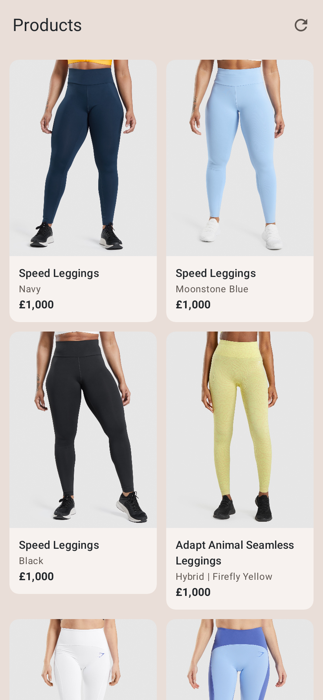
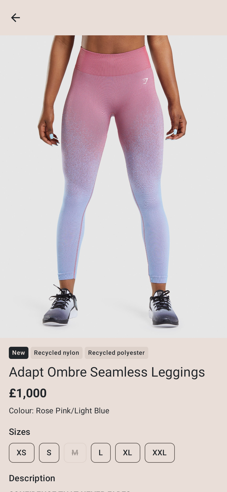

# GymShark ECom

A small Android shop app. It loads products from a JSON endpoint, shows them in a grid with their labels,
and opens a detail screen with sizes and the HTML description. Kotlin, Jetpack Compose, MVVM.

<p>
  
  
</p>

## Features

**Screens**
- Product grid with image, title, colour, price and label badges
- Detail screen with image, labels, price, colour, fit, sizes and the HTML description
- Sold-out sizes crossed out, "Out of stock" on sold-out products

**Errors and bad data**
- Loading, error and empty states with Retry
- Refresh button; if a refresh fails, the list stays and a Retry row shows
- "No internet" shown straight away, before the request
- Missing image shows a plain tile, broken image shows tap to retry
- Products missing an id, title or price are skipped

**State and caching**
- In-memory cache, so the detail screen opens without a second request
- Keeps state on rotation and process death

**Navigation**
- List to detail and back
- Deep link `gsecom://product/{id}`, with a demo notification

**Design**
- Light and dark theme in the brand colours `#212529` and `#E9DED8`

**Accessibility**
- TalkBack headings and click labels
- Loading and errors announced
- Sold-out sizes read out as "sold out"

**Build**
- Staging and production flavors
- CI runs tests, lint and a build on every push

## How to run

1. Open the project in **Android Studio Panda 2 (2025.3.2) or newer** (File → Open → this folder).
2. Wait for Gradle sync, then press **Run** on an emulator or phone (Android 8.0, API 26+).

No API keys or extra setup. Android Studio's bundled JDK is enough.

Two build flavors set the API URL in `app/build.gradle.kts`: **staging** (default) and **production**.
Switch them under **Build Variants**.

Deep link: `gsecom://product/{id}` opens a product. For a demo, tap the **Products** title to post a
notification, then tap the notification. Or from a terminal:
`adb shell am start -a android.intent.action.VIEW -d "gsecom://product/6732609257571"`

## How to run the tests

- Android Studio: right-click `app/src/test` → **Run 'Tests in test'**
- Command line: `./gradlew testStagingDebugUnitTest` (Windows: `gradlew.bat testStagingDebugUnitTest`)

Five simple unit tests with hand-written fakes:

## Structure

Clean Architecture in one `app` module, MVVM with one-way data flow.

```
app/src/main/java/com/k3n3sh/gsecom/
├── domain/        Models, Outcome + DataError, repository interface, use cases (plain Kotlin)
├── data/          Retrofit API and DTOs, mapper, connectivity check, repository with cache
├── presentation/  ViewModels, Compose screens and components, navigation, theme
└── di/            Hilt modules
```

The screen calls a ViewModel function (`loadProducts()`, `refresh()`), the ViewModel calls a use case,
and the result comes back as one immutable `UiState` in a `StateFlow`.

## Libraries

| Library | Used for |
|---|---|
| Jetpack Compose + Material 3 | All screens and the theme |
| Compose `AnnotatedString.fromHtml` | HTML description, no WebView |
| Navigation Compose | List to detail, and the deep link |
| Lifecycle ViewModel | Screen state that survives rotation |
| Hilt | Dependency injection |
| Retrofit | Calling the product API |
| kotlinx.serialization | JSON to Kotlin classes, and type-safe routes |
| OkHttp | HTTP client, shared by Retrofit and Coil |
| Coil 3 | Loading and caching images |
| Kotlin Coroutines + Flow | Background work and `StateFlow` state |
| JUnit 4 + coroutines-test | Unit tests |

Versions live in `gradle/libs.versions.toml`, with a note on any held back.

## AI use (Super Intelligence :) )

| Block | Engineer | AI | Lead / Review / Approved |
|---|---|---|---|
| Brief, scope, working rules | Wrote them | Understood context | Engineer |
| Architecture (Clean Architecture, MVVM with one-way data flow) | Chose it | Laid out the folders and classes | Engineer |
| Library choices | Picked each one | Gradle setup and initialisation | Shared |
| Features: flavors, deep link, image retry | Chose & wrote them | Fixed errors faster than me | Engineer |
| UI Theme and Branding | Brand colours, trimmed the design | Proposed the grid, badges and accents | Shared |
| API data review and smaller API | Chose & wrote them | Data validated and analysed (e.g. photo URL not working) | Shared |
| Error handling (Outcome / DataError) | Chose it | Wrote them | Engineer |
| Domain (models, use cases) | Designed & wrote them | Fixed errors | Engineer |
| Data (API, DTOs, mapper, repository, cache) | Designed | Wrote them | Shared |
| ViewModels and UI state | Wrote them | Fixed errors | Engineer |
| Hilt DI | Chose & designed | Helped with dependency sharing and module identification | Shared |
| Compose screens | Wrote them | Fixed issues and improved UX | Shared |
| Compose components | Wrote them | — | Engineer |
| Navigation, deep link, notification | Designed & wrote them | Fixed errors | Shared |
| Flavors | Wrote them | — | Shared |
| Comments and README | Content direction | Drafted them | AI |
| Test plan (5 tests, naming, simple style) | Set it | Followed it | Engineer |
| Writing tests and fakes | Had them simplified | Wrote them | AI |
| Build, lint and unit tests after each step | Ran them | Ran them | AI |
| Testing on a real device | Did it, found issues and rotation issues | — | Engineer |


## With more time
- Save products with Room so the list works offline
- Search, filter and sort by colour, size and label (UI on the list, rules in the use case)
- Size picker and add to bag
- Use the currency from the API (it assumes GBP today)
